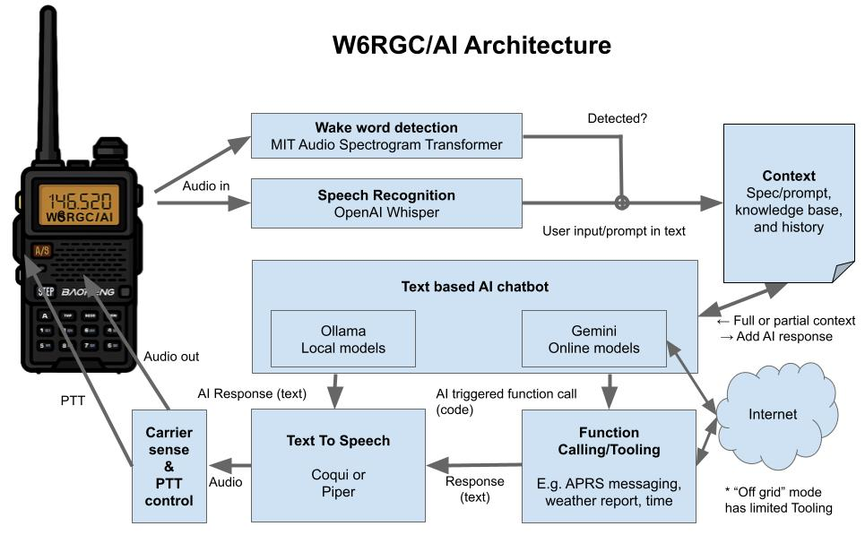

# W6RGC/AI: AI amateur radio operator and voice assistant
AI is changing everything. [7?](https://en.wikipedia.org/wiki/Wire_signal) Are you ready?

## Overview

W6RGC/AI brings the power of modern artificial intelligence to amateur radio through an AI ham operator and voice assistant named "Seven." It acts as an AI co-pilot, designed to work both on and off the internet, turning your radio into a direct interface for advanced capabilities. Activate Seven with its name, then speak as you would to another operator, like "Seven. This is W6RGC. Lets do a QSO." or "Seven. What are you good at?"

The project is designed for two main groups: radio operators who want to experiment with an intelligent assistant on the air and developers who want a platform to experiment with AI and radio hardware.

### For the Radio Operator: An AI Co-Pilot

Seven is trained on standard radio procedures to be a capable and helpful partner on the airwaves. It can:

*   **Handle QSOs:** Manage exchanges of call signs, names, locations, and signal reports.
*   **Run Nets:** Serve as a net control station for simple nets, handling check-ins and maintaining a participant list.
*   **Assist with ARES/RACES:** Transcribe and confirm messages using the FEMA ICS-213 format.

With natural voice commands, you can also access a growing set of internet-connected tools:

*   **Voice APRS:** Send and receive APRS messages just by talking.
*   **Location identification:** Find a Maidenhead grid square and GPS coordinates for a location you describe.
*   **Wikipedia Search:** Ask for a summary of any Wikipedia article.
*   **Weather Reports:** Get current conditions and forecasts for any location.
*   **Time and date:** Get the current time for any timezone

### For the Developer and Tinkerer: A Modular AI Playground

This project is an open framework for experimenting with AI in real-world communication systems. It's built to be modified and extended.

*   **Modular Architecture:** Easily swap core components like AI models, prompts, and hardware interfaces.
*   **Flexible LLM Support:** Switch between online models like Google's Gemini for powerful, feature-rich operation and offline models via Ollama (e.g., Gemma, Llama 3) for grid-down or private use.
*   **Extensible Tooling:** Add new voice-activated functions. The code provides clear examples for creating your own tools, whether through function-calling or regular expressions.
*   **Open Source AI Stack:** The pipeline uses a combination of accessible models, including MIT-AST for wake-word detection, OpenAI Whisper for speech-to-text, and Piper TTS for natural speech generation.
*   **Hardware Integration:** Includes out-of-the-box support for popular Digirig and AIOC radio interfaces.

Whether you are an emergency communicator exploring new tools or a developer curious about the intersection of AI and radio, W6RGC/AI offers a platform to learn, build, and innovate.

## Voice APRS Demo

Voice APRS demonstrates the natural language APRS capabilities of W6RGC/AI, allowing operators to send and receive APRS messages using conversational voice commands.

[](https://www.youtube.com/watch?v=f69otUIe1ko)

**[📺 Watch the Voice APRS Demo Video](https://www.youtube.com/watch?v=f69otUIe1ko)**

**Example Voice Commands:**
- "Seven, send an APRS message to N0CALL saying hello from the AI assistant"
- "Seven, read my APRS messages"  
- "Seven, check if I have any new APRS traffic"

**Features:**
- Natural language processing for APRS operations
- Automatic message formatting and validation
- Integration with findu.com APRS gateway
- Supports both sending and receiving messages
- Phonetic readback of callsigns and messages

## Design

W6RGC/AI explores and leverages the following AI models in concert:

1.  **AI-based wake word spotting** 
    - Uses [MIT/AST](https://huggingface.co/MIT/ast-finetuned-speech-commands-v2)
    -   Listens for "Seven" by default (like "Are you Ready?" in [Western Union 92 codes](https://en.wikipedia.org/wiki/Wire_signal))
    -   You can choose from over 35 other options
2.  **AI-based speech-to-text**
    - Uses [OpenAI Whisper](https://github.com/openai/whisper) speech recognition
3.  **Modular LLMs for the brains of the operation** 
    - The current default uses the online [Gemini](https://gemini.google.com/) "[gemini-1.5-flash-preview-0514](https://cloud.google.com/vertex-ai/generative-ai/docs/models/gemini/1-5-flash)" model and requires a developer key
    - A one-line change (`HAS_INTERNET`) switches to an offline [Ollama](https://ollama.com/) model, like "[gemma2:9b](https://ollama.com/library/gemma2)"
    - Plug in your own models and prompts!
4.  **Ham radio prompts**. Example prompts for:
    - Performing QSOs
    - Running nets
    - Copying FEMA ICS-213 forms
5.  **AI-based tooling and function calling**
    - Uses [Gemini Function Calling](https://ai.google.dev/gemini-api/docs/function-calling?example=meeting)
    - Example: "Voice APRS" sends and receives APRS messages using Natural Language Understanding.
    - A regular expression-based system is also available 
6.  **AI-based text-to-speech** using [Piper TTS](https://github.com/rhasspy/piper) to give the bot a voice



The code is designed for modularity, making it easy to swap and compare AI models, prompts, and function calling. The system is organized into several key modules:

- **`main.py`**: Main application entry point and orchestration
- **`constants.py`**: Centralized configuration for all settings
- **`regex_command_tooling.py`**: Parses voice commands like status, reset, identify, and terminate
- **`ril_aioc.py`**: Radio Interface Layer for AIOC hardware
- **`ril_digirig.py`**: Radio Interface Layer for Digirig hardware
- **`context_manager.py`**: Manages the AI's persona and conversation history
- **`wake_word_detector.py`**: AST-based wake word detection
- **`periodically_identify.py`**: Handles periodic station identification
- **`aprs_helper.py`**: Sends and receives APRS messages via findu.com
- **`wikipedia_helper.py`**: Fetches article summaries from the Wikipedia API.
- **`location_helper.py`**: Converts natural language location descriptions to GPS coordinates using the Google Places API.
- **`speech_recognition.py`**: Whisper-based speech-to-text processing
- **`llm_gemini_online.py`**: Integrates with the Google Gemini API, including function calling
- **`llm_ollama_offline.py`**: Manages local LLM integration with Ollama for offline operation

## Setup and Installation

### Prerequisites

*   **CUDA Hardware:** For GPU acceleration, this project requires dedicated GPU hardware to run local AI models. A [Nvidia GeForce RTX 3060](https://www.nvidia.com/en-us/geforce/graphics-cards/30-series/rtx-3060-3060ti/) or better is recommended.
*   **Audio Hardware with PTT:** Digirig and AIOC (All-In-One-Cable) are supported.
*   **Operating System:** This project has only been tested on Linux.
*   **Required Linux Packages:** Install the following packages using your package manager:
    ```bash
    sudo apt update
    sudo apt install python3-full portaudio19-dev ffmpeg
    ```
*   **User Permissions:** Add your user to the `dialout` group for serial port access:
    ```bash
    sudo usermod -a -G dialout $USER
    ```
    Log out and back in for changes to take effect
*   **Ollama:** Install Ollama by running the following command in your terminal:
    ```bash
    curl -fsSL https://ollama.com/install.sh | sh
    ```
    After installation, ensure the Ollama service is running and you have pulled a model (e.g., `ollama pull gemma2:9b`).

### Installation Steps

1.  **Clone the repository:**
    ```bash
    git clone https://github.com/richcannings/w6rgc-ai
    cd w6rgc-ai
    ```
2.  **Create a Python virtual environment (recommended):**
    ```bash
    python3 -m venv venv
    source venv/bin/activate
    ```
3.  **Install Python dependencies:**
    ```bash
    pip install -r requirements.txt
    ```
4.  **Set up Ollama (if not done in prerequisites):**
    *   Ensure the Ollama server is running (usually `ollama serve` or `systemctl start ollama`)
    *   If you haven't already, pull your desired LLM model (e.g., `ollama pull gemma2:9b`)
5.  **Hardware Setup:**
    *   Connect your AIOC or Digirig adapter via USB
    *   The system will automatically detect the audio device and serial port
    *   Configure the hardware type in `constants.py` by setting `DEFAULT_RIL_TYPE` to either "aioc" or "digirig"

## Usage

1.  **Configure the application:**
    *   **Primary Configuration**: Edit `constants.py` to modify a few settings:
      - `BOT_CALLSIGN` and `BOT_PHONETIC_CALLSIGN`
      - If you are using a Digirig, update `DEFAULT_DIGIRIG_SERIAL_PORT`. The system automatically detects the correct audio device for both AIOC and Digirig hardware.
      - Some features may not work until you download the required models (e.g., Piper for TTS) or provide an API key (e.g., for weather reports).
      - Explore the file for more settings to tinker with.
    *   **Advanced Configuration**: Customize the AI persona and prompts in `context_manager.py`. You can also manually set the serial port in `constants.py` if auto-detection fails.

2.  **Run the main script:**
    ```bash
    python main.py
    ```

## Operation

Your radio is the main interface for input and output. The application will start and listen for the configured wake word (default: "Seven"). To interact, say the wake word at the start of your transmission once or twice, followed by your command or query speaking as how you would speak with another operator.

Example: "Seven, what are your commands?", "Seven, start a net. You are Net Control Station.", "Seven, send an APRS message.", or "Seven, what time is it in Eastern?"

To terminate the assistant: "Seven, break" or "Seven, exit" or use Ctrl+C in the terminal.

## Wake Word Detection and Changing Wake Word

The system uses MIT's AST (Audio Spectrogram Transformer) model for efficient wake word detection:

- **35+ Available Wake Words:** backward, bed, bird, cat, dog, down, eight, five, follow, forward, four, go, happy, house, learn, left, marvin, nine, no, off, on, one, right, seven, sheila, six, stop, three, tree, two, up, visual, wow, yes, zero
- **Current Default:** "seven"
- **High Performance:** Fast, low CPU usage, and high accuracy

To change the wake word, modify `BOT_NAME` and `DEFAULT_WAKE_WORD` in `constants.py` to any of the supported words. It's easier for both the user and the AI when `BOT_NAME` matches the `DEFAULT_WAKE_WORD`.

## Configuration

The application uses a centralized configuration system in `constants.py`. Key sections include:
```python
# Internet Connectivity and LLM Selection
HAS_INTERNET = True  # Set to True for Gemini (online), False for Ollama (offline)

# Ollama Configuration
OLLAMA_URL = "http://localhost:11434/api/generate"
DEFAULT_OFFLINE_MODEL = "gemma2:9b"  # Example: "llama3:8b"

# Gemini Configuration
GEMINI_API_KEY_FILE = "gemini_api_key.txt"  # Store your Gemini API key in this file
DEFAULT_ONLINE_MODEL = "models/gemini-1.5-flash-preview-0514" # Example: "gemini-1.5-pro"
MAX_RETRIES = 3
RETRY_DELAY = 1.0  # seconds
REQUEST_TIMEOUT = 30  # seconds

# Weather API Configuration (for weather function calling)
WEATHER_API_KEY_FILE = "weather_api_key.txt"  # Store your OpenWeatherMap API key here

# Google Places API Configuration
GOOGLE_PLACES_API_KEY_FILE = "google_places_api_key.txt" # Store your Google Places API key here
```

### Wake Word Detection
```python
# AST Wake Word Detection
DEFAULT_WAKE_WORD = BOT_NAME # syncing bot name with wake word
AST_CONFIDENCE_THRESHOLD = 0.7
AST_CHUNK_LENGTH_S = 1.0
AST_MODEL_NAME = "MIT/ast-finetuned-speech-commands-v2"

# Wake Word Detection Method
# WAKE_WORD_METHOD_AST = "ast" # This is an internal constant, usually not changed by user
DEFAULT_WAKE_WORD_METHOD = "ast" # Currently "ast" is the primary method

# Command Detection Configuration
MAX_COMMAND_WORDS = 10  # maximum words to check for commands (prevents accidental triggers)
```

### Hardware Configuration
```python
# Radio Interface Layer (RIL) Configuration
RIL_TYPE_AIOC = "aioc"
RIL_TYPE_DIGIRIG = "digirig"
DEFAULT_RIL_TYPE = RIL_TYPE_DIGIRIG  # Options: "aioc" or "digirig". Change this to switch.

# Serial Port Configuration
DEFAULT_AIOC_SERIAL_PORT = "/dev/ttyACM0"  # Serial port for AIOC PTT control
DEFAULT_DIGIRIG_SERIAL_PORT = "/dev/ttyUSB1" # Serial port for Digirig PTT control
SERIAL_TIMEOUT = 1  # seconds

# Carrier Sense Configuration
CARRIER_SENSE_DURATION = 0.5  # seconds to monitor for carrier before PTT
CARRIER_SENSE_MAX_RETRIES = 3  # maximum attempts to find clear frequency
CARRIER_SENSE_RETRY_DELAY = 3.0  # seconds to wait between carrier sense attempts

# Periodic Identification Configuration
PERIODIC_ID_INTERVAL_MINUTES = 10  # minutes between automatic identification announcements
```

### Bot Identity
```python
OPERATOR_NAME = "Operator"
BOT_NAME = "seven" # Choose from available wake words, e.g., seven, marvin, sheila, zero, happy, forward.
BOT_CALLSIGN = "W6RGC/AI"      # Amateur radio callsign
BOT_SPOKEN_CALLSIGN = "W 6 R G C stroke A I"
BOT_PHONETIC_CALLSIGN = "Whiskey 6 Romeo Golf Charlie Stroke Alpha India"
```

### TTS Configuration
```python
# Script File Path for logging conversation
WRITE_SCRIPT_TO_FILE = False

# TTS Model Options
TTS_MODEL_FAST_PITCH = "tts_models/en/ljspeech/fast_pitch"
TTS_MODEL_SPEEDY_SPEECH = "tts_models/en/ljspeech/speedy_speech"
TTS_MODEL_TACOTRON2 = "tts_models/en/ljspeech/tacotron2-DDC"

# TTS Audio Settings
TTS_INFERENCE_NOISE_SCALE = 0.667
TTS_INFERENCE_NOISE_SCALE_DP = 1.0
TTS_INFERENCE_SIGMA = 1.0

# TTS File Configuration
TTS_OUTPUT_FILE = 'audio/tts_output.wav'
```

## Advanced Features

### VoiceAPRS (Function Calling)
The system includes natural language APRS functionality through Gemini's function calling capabilities:

- **Send APRS Messages**: "Seven, send an APRS message to N0CALL saying hello"
- **Read APRS Messages**: "Seven, read my APRS messages" (requires your callsign in `constants.py`)
- **Integration**: Uses findu.com for APRS operations
- **Requirements**: Internet connection and Gemini API access

### Weather Information (Function Calling)
The system provides comprehensive weather information through natural language voice commands:

- **Current Weather**: "Seven, what's the weather like in San Francisco?"
- **3-Day Forecast**: "Seven, give me the weather forecast for New York"
- **Detailed Information**: Includes temperature, conditions, humidity, highs/lows, and precipitation probability
- **Integration**: Uses OpenWeatherMap API for reliable weather data
- **Requirements**: Internet connection, Gemini API access, and OpenWeatherMap API key in `weather_api_key.txt`

**Example Voice Commands:**
- "Seven, what's the weather like in Los Angeles, California?"
- "Seven, can you give me the 3-day forecast for Chicago?"
- "Seven, what are the weather conditions in London, England?"

### Time Zone Information (Function Calling)
The system provides current time and date information for any timezone through natural language voice commands:

- **Current Time**: "Seven, what time is it?" (defaults to Pacific Time)
- **Specific Timezone**: "Seven, what time is it in Eastern?" or "Seven, what's the time in New York?"
- **International Time**: "Seven, what time is it in London?" or "Seven, what time is it in Tokyo?"
- **UTC/GMT Time**: "Seven, what's the current UTC time?"
- **Format**: Time is returned in 12-hour format without seconds, and the date is returned without the year.
- **Default**: Automatically defaults to Pacific Time if no timezone is specified.

**Example Voice Commands:**
- "Seven, what time is it right now?"
- "Seven, what time is it in Eastern time?"
- "Seven, can you tell me the time in London?"
- "Seven, what's the current UTC time?"
- "Seven, what time is it in Tokyo?"

### Carrier Sense
Both AIOC and Digirig interfaces include carrier sense functionality:
- Checks for channel activity before transmitting
- Configurable duration, retries, and delays
- Prevents interference with ongoing QSOs

### Periodic Identification  
Automatic station identification every 10 minutes (configurable):
- Announces the AI assistant and how to interact with it
- Complies with FCC Part 97 identification requirements
- The timer resets after each transmission

## Troubleshooting

### Common Issues

**Audio Device Not Found:**
- Ensure your AIOC or Digirig adapter is connected
- Check `lsusb` output for USB audio device
- Verify user is in `dialout` group: `groups $USER`

**Serial Port Issues:**
- Check available serial ports: `ls /dev/ttyUSB* /dev/ttyACM*`
- If auto-detection fails, update `DEFAULT_AIOC_SERIAL_PORT` or `DEFAULT_DIGIRIG_SERIAL_PORT` in `constants.py`
- Verify permissions: `sudo chmod 666 /dev/ttyUSB0` (or relevant port)

**Wake Word Not Detected:**
- Check microphone levels and background noise.
- Adjust `AST_CONFIDENCE_THRESHOLD` in `constants.py`.
- Try a different wake word, such as "marvin," "sheila," "zero," "happy," or "forward."

**LLM Connection Issues:**
- **Ollama**: Ensure the service is running: `systemctl status ollama`
- **Gemini**: Check API key in `gemini_api_key.txt`
- **Models**: Verify model availability: `ollama list` or test with `python list_gemini_models.py`

**Weather Service Issues:**
- **API Key**: Ensure valid OpenWeatherMap API key in `weather_api_key.txt`
- **Internet**: Weather service requires internet connection
- **Test**: Run `python weather_helper.py` to test functionality.
- **API Limits**: The free tier has usage limits; check your OpenWeatherMap dashboard.

Enable debug output for wake word detection:
```python
# In wake_word_detector.py, set debug=True when calling listen_for_wake_word
wake_detected = wake_detector.listen_for_wake_word(
    audio_device_index=audio_index,
    debug=True  # Shows prediction scores and confidence levels
)
```

## Hardware Requirements

*   **Minimum:** CPU with 4+ cores, 32GB RAM, and 10GB disk space (not including Ollama models)
*   **GPU with CUDA support:** NVIDIA RTX 3060 with 12GB RAM recommended for optimal performance
*   **Radio interface:** Digirig, AIOC (All-In-One-Cable), or other compatible USB audio interface with PTT control

## Testing and Development

The project includes several testing utilities:

- **Wake word testing**: Use the built-in debug modes in the wake word detector.
- **Module testing**: Each module includes a `if __name__ == "__main__"` block for direct testing.  
- **Command testing**: Test voice command recognition with `regex_command_tooling.py`.

To test individual components:
```bash
python ril_aioc.py                    # Test AIOC hardware interface
python ril_digirig.py                 # Test Digirig hardware interface
python wake_word_detector.py          # Test wake word detection
python regex_command_tooling.py       # Test command identification
python periodically_identify.py       # Test periodic identification
python list_gemini_models.py          # List available Gemini models and test API access
python weather_helper.py              # Test weather API functionality
python test_weather_integration.py    # Test weather integration with Gemini
python time_helper.py                 # Test time zone functionality
python test_time_integration.py       # Test time zone integration with Gemini
```

## License

Copyright 2024 Rich Cannings

Licensed under the Apache License, Version 2.0 (the "License");
you may not use this file except in compliance with the License.
You may obtain a copy of the License at

    http://www.apache.org/licenses/LICENSE-2.0

Unless required by applicable law or agreed to in writing, software
distributed under the License is distributed on an "AS IS" BASIS,
WITHOUT WARRANTIES OR CONDITIONS OF ANY KIND, either express or implied.
See the License for the specific language governing permissions and
limitations under the License.